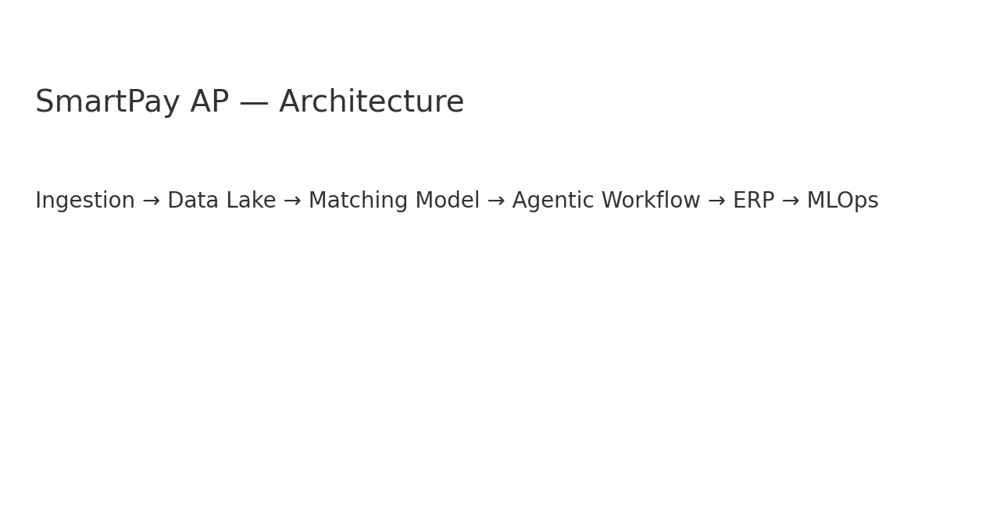

Acme SmartPay AP – AI Reconciliation System
📌 Overview

This project implements an AI-powered invoice reconciliation system for Acme Manufacturing (SmartPay AP).
It automates the process of matching invoices with Purchase Orders (POs) and Goods Receipt Notes (GRNs), using:

D2: Machine Learning model (RandomForest) for mismatch detection

D3: Agentic workflow (LangGraph) with human-in-the-loop approval

D4: Responsible AI practices (bias, audit, monitoring)

The system is modular and extensible, designed for enterprise deployment.

⚙️ Setup Instructions
1. Clone Project
git clone <your-repo-url>
cd acme_smartpay_ap

2. Create Virtual Environment
python -m venv .venv
.venv\Scripts\activate   # (Windows)
source .venv/bin/activate  # (Linux/Mac)

3. Install Dependencies
pip install -r requirements.txt

4. Data Files

Ensure the following CSV files are present inside data/:

invoices.csv

po_grn.csv

labelled_mismatches.csv

5. Train Model (D2)
python scripts/train_model.py


This creates the model file:

models/matcher.pkl

6. Run Workflow (D3)

Example for one invoice:

python scripts/run_workflow.py --invoice_id INV0134


Expected behavior:

If high-confidence match → auto-approve

If mismatch or low-confidence → explanation + draft email → pause for human approval

7. Run Tests
pytest tests/ -v

📝 Assumptions

Data format: invoice_id, vendor, amounts, dates are consistent with provided sample CSVs.

Only binary classification:

0 = Match

1 = Mismatch

Auto-approval threshold = 0.9 (can be tuned).

Human-in-loop step is simulated in CLI (not an actual UI/email system).

📂 Project Structure
acme_smartpay_ap/
│── data/                 # Input CSV datasets
│   ├── invoices.csv
│   ├── po_grn.csv
│   └── labelled_mismatches.csv
│
│── models/               # Trained models (joblib)
│   └── recon_model.pkl
│
│── scripts/              # Entry-point scripts
│   ├── train_model.py
│   └── run_workflow.py
│
│── src/                  # Core source code
│   ├── data_loader.py
│   ├── features.py
│   ├── agent_tools.py
│   └── workflow_graph.py
│
│── tests/                # Pytest unit tests
│   └── test_workflow.py
│
│── docs/                 # Deliverables (D1–D6 PDFs)
│
│── README.md             # (This file)
│── requirements.txt

🚀 How to Run End-to-End

Train the model (scripts/train_model.py).

Run reconciliation workflow (scripts/run_workflow.py --invoice_id <ID>).

Observe console output for auto-approve OR human-in-loop flow.

Optionally run tests (pytest).

✅ Responsible AI Notes

Bias mitigation → retrain with diverse data, monitor for skew.

Data privacy → encryption + RBAC assumed.

Audit trail → logs of predictions, explanations, approvals.

Monitoring → track model drift + retrain periodically.


# Acme SmartPay AP — Matching Model (D2, D6, D1, D4)

This repository contains a minimal-yet-production-style implementation of **Acme's SmartPay AP** matching model and docs.

## 🧭 Architecture (D1)


## 🚀 Quickstart
```bash
python -m venv .venv
.venv\Scripts\activate   # (Windows)
pip install -r requirements.txt
python scripts/train_model.py
python scripts/evaluate_model.py
```

## 📊 Sample Evaluation Output (from the pre-trained RandomForest)
```
Classification Report (Test Split):
              precision    recall  f1-score   support

           0     0.6000    0.6000    0.6000         5
           1     0.7143    0.7143    0.7143         7

    accuracy                         0.6667        12
   macro avg     0.6571    0.6571    0.6571        12
weighted avg     0.6667    0.6667    0.6667        12


Confusion Matrix (Test Split):
[[3 2]
 [2 5]]
```

## 📦 Deliverables
- **D1** → docs/D1_Architecture.pdf
- **D2** → src/, scripts/, models/matcher.pkl, data/
- **D4** → docs/D4_ResponsibleAI.pdf
- **D6** → this README
